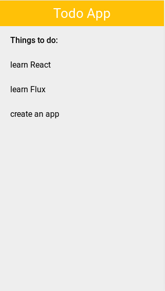

# Exercise 2

## Run example:

```
$ cd src
$ npm install
$ npm start
```

Open in your browser [http://localhost:8080](http://localhost:8080).

## Exercise
* Create the markup of a simple todo app
* Add some basic styles


