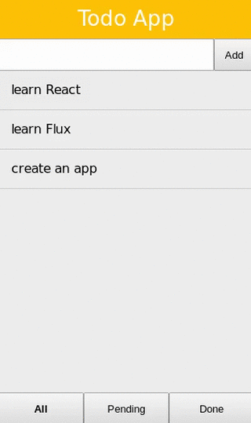

# Exercise 3

## Run example:

```
$ cd src
$ npm install
$ npm start
```

Open in your browser [http://localhost:8080](http://localhost:8080).

## Exercise
* Add a text input to add new todos to the list
* The user should be able to toggle a todo as done/pending
* Implement a way to filter the list to show only the 'done', 'pending' or 'all' todos.

