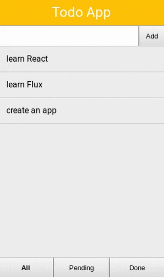

# Exercise 5

## Run example:

```
$ cd src
$ npm install
$ npm start
```

Open in your browser [http://localhost:8080](http://localhost:8080).

## Exercise
* install [jss](https://github.com/jsstyles/react-jss):
```
$ npm install --save jss react-jss
```
* create your module with the ``useSheet`` function configured with the plugins you're going to use in your app. Follow the instructions [here](https://github.com/jsstyles/react-jss#es6)
* install some jss plugins:
```
$ npm install --save jss-nested jss-camel-case jss-default-unit
```
* add them to your jss config with the ``jss.use()`` method
* refactor the ``Todo`` component to use jss for styles
* change the ``Todo`` background color when ``:active``


